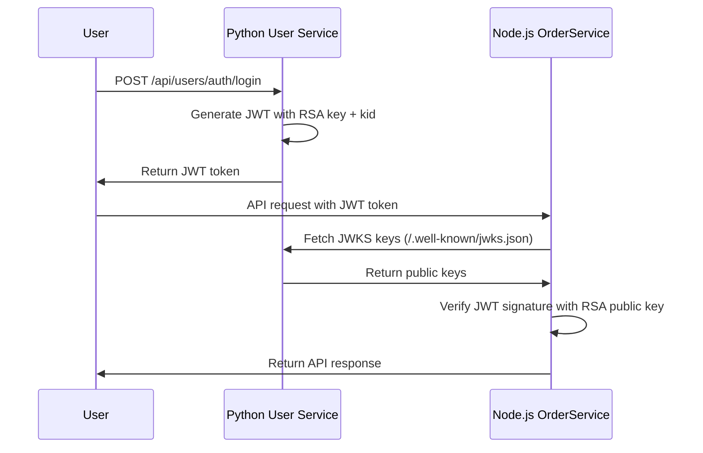

# Authentication Workflow

This guide shows you how to use the **Node.js User Service** login token with the **Node.js OrderService**, just like the Python and .NET implementations.

## 🎉 Node.js User Service Now Supports RSA + JWKS!

The Node.js User Service has been **upgraded** to work exactly like Python and .NET implementations:
- ✅ **RSA JWT tokens** with `kid` in header  
- ✅ **JWKS endpoint** at `/.well-known/jwks.json`
- ✅ **Compatible with OrderService** JWKS authentication
- ✅ **Same workflow** as Python/C# implementations

## 🔄 Complete Authentication Flow

### Step 1: Start Services

1. **Start Node.js User Service** (port 5000):
   ```bash
   cd D:/Code/user-authentication/nodejs/external-user-service/user-service
   npm start
   ```

2. **Start Node.js OrderService** (port 5001):
   ```bash
   cd D:/Code/user-authentication/nodejs/external-user-service/OrderService
   npm start
   ```

### Step 2: Test JWKS and Login

1. **Run "Test JWKS Endpoint"** request
   - Verifies that the Node.js User Service now has JWKS support
   - Shows the RSA key information and `kid`

2. **Run "Login to User Service"** request
   - Authenticates with the **Node.js User Service** (not Python!)
   - JWT token automatically set in environment
   - Token now has RSA signature with `kid` (Key ID)

3. **Verify Token Structure**:
   - ✅ Algorithm: RS256 (RSA signature)
   - ✅ Header contains `kid` (Key ID)  
   - ✅ Signed by Node.js User Service RSA private key

### Step 3: Test OrderService Authentication

1. **Run "Test Full Auth Flow"** request
   - This tests the OrderService with the JWT token
   - Should return customer data if authentication succeeds

### Step 4: Use Any OrderService Endpoint

Now you can use any OrderService endpoint:
- All Customer endpoints
- All Product endpoints  
- All Order endpoints

## 🔧 How It Works



## 🔍 Token Verification Process

1. **Extract `kid`** from JWT header
2. **Fetch JWKS** from Python User Service
3. **Find matching key** using `kid`
4. **Convert to PEM** format for verification
5. **Verify signature** using RSA public key
6. **Check expiration** and other claims

## 🚨 Troubleshooting

### "Token missing key ID"
- You're using Node.js User Service token (HMAC)
- **Solution**: Use Python User Service token (RSA + kid)

### "Unable to find appropriate key" 
- JWKS endpoint not accessible
- **Solution**: Ensure Python User Service is running on port 5000

### 401 Unauthorized
- Token expired or invalid
- **Solution**: Get a fresh token using "Login to User Service"

## ✅ Success Indicators

- ✅ Login request returns `accessToken`
- ✅ Token automatically set in environment
- ✅ OrderService API calls return 200 OK
- ✅ No "kid" or JWKS errors in logs

## 📝 Default Login Credentials

Update the login request with your user credentials:
```json
{
  "phone": "+1234567890",
  "password": "Test@123",
  "loginRoleId": null
}
```
